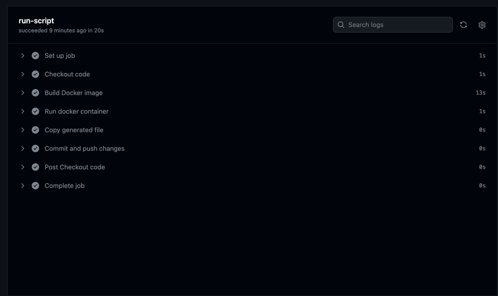
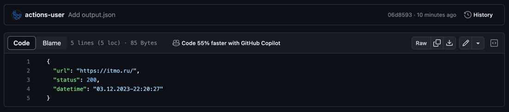

# Лабораторная работа №3

## Основное задание

### Текст задачи

Сделать, чтобы после пуша в ваш репозиторий автоматически собирался докер образ и результат его сборки сохранялся
куда-нибудь. (например, если результат - текстовый файлик, он должен автоматически сохраниться на локальную машину, в
ваш репозиторий или на ваш сервер).

### Ход работы

1) Для начала написал скрипт main.py, которые открывает main.json, делает запрос к сайту в файле, отправляет результат
   запроса в файл output.json.

```python
import json
import requests
from datetime import datetime

try:
    with open('main.json', 'r', encoding='utf-8') as f:
        data = json.load(f)
        if data['link']:
            response = requests.get(data['link'])

    with open(
            'output.json',
            'a',
            encoding='utf-8',
    ) as t:
        d = dict(
            url=response.url,
            status=response.status_code,
            datetime=datetime.now().strftime('%d.%m.%Y-%H:%M:%S'),
        )
        json.dump(d, t, ensure_ascii=False, indent=2)
except Exception as err:
    with open(f'output.json', 'a', encoding='utf-8'):
        d = dict(
            error=str(err),
            datetime=datetime.now().strftime('%d.%m.%Y-%H:%M:%S'),
        )
```

2) Написал Dockerfile

```dockerfile
FROM python:3.12

WORKDIR /app

RUN pip install requests

COPY . /app

CMD ["python", "main.py"]
```

3) Для того, чтобы собрать образ на GitHub, а также для того, чтобы он собирался при каждом пуше в папку lab3, написал
   GitHub Actions workflow

```yaml
name: Docker Build and Main Script

on:
  push:
    paths:
      - 'DevOps/lab3/**'

jobs:
  run-script:
    runs-on: ubuntu-latest
    steps:
      - name: Checkout code
        uses: actions/checkout@v4

      - name: Build Docker image
        run: docker build -t lab3 ./DevOps/lab3

      - name: Run docker container
        run: docker run --name lab3_container lab3

      - name: Copy generated file
        run: docker cp lab3_container:/app/output.json $GITHUB_WORKSPACE/DevOps/lab3/

      - name: Commit and push changes
        run: |
          git config --global user.email "actions@github.com"
          git config --global user.name "GitHub Actions"
          git add DevOps/lab3/output.json
          git commit -m "Add output.json"
          git push
```

4. Запушил файлы на GitHub. GitHub Action в репозитории:
   
5. Результат сборки сохранился в по адресу `DevOps/lab3/output.json`
   

### Вывод

Мне удалось автоматизировать сборку Dockerfile, используя принципы CI/CD.